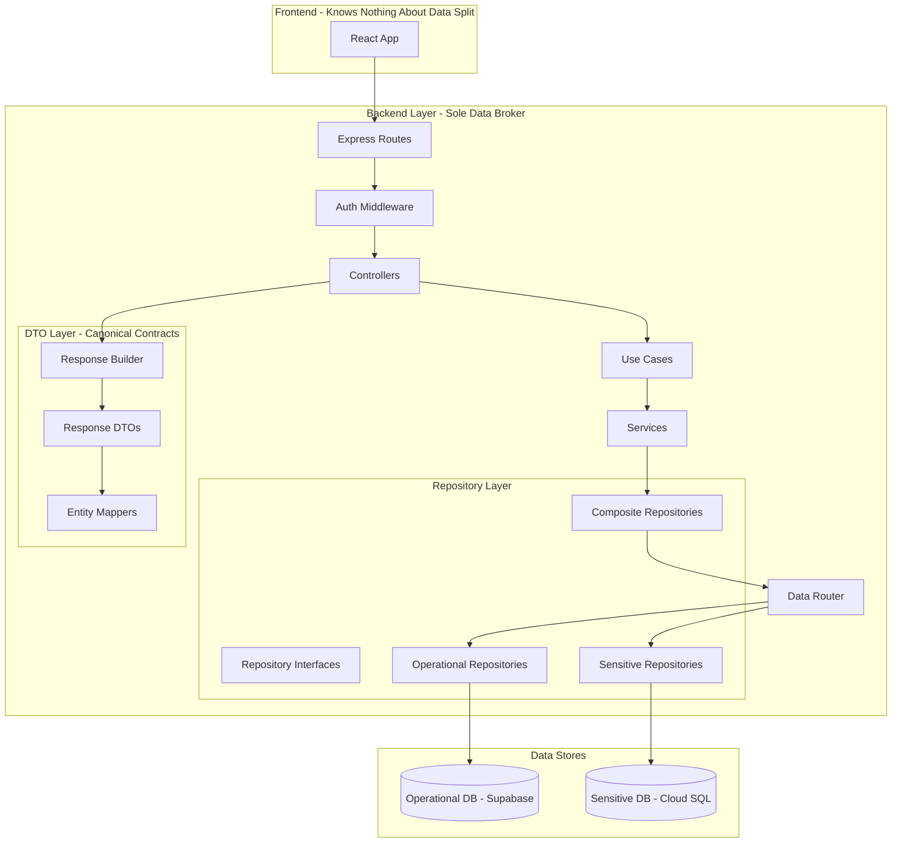
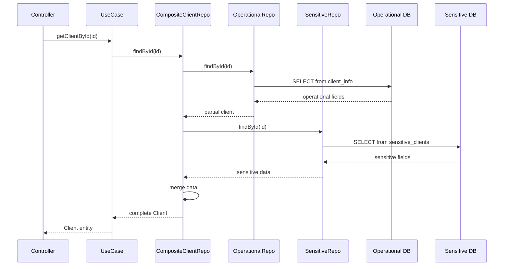

# Split-Database Backend Migration Plan

## Non-Negotiable API Contract With Frontend

**All endpoints MUST return standardized response shapes in PRIMARY mode. No
exceptions.**

| Response Type | Shape                                                             |
| ------------- | ----------------------------------------------------------------- |
| Success       | `{ "success": true, "data": <T>, "meta"?: {...} }`                |
| Error         | `{ "success": false, "error": "<message>", "code"?: "<code>" }`   |
| List          | `{ "success": true, "data": <T[]>, "meta": { "count": number } }` |

**Hard Rules:**

1. DTOs are canonical. Controllers NEVER return raw DB rows or `entity.toJson()`
2. Endpoints that frontend depends on MUST keep response fields stable across
   migration
3. Frontend never learns about data boundaries - backend is the sole broker
4. **In PRIMARY mode**: All list endpoints MUST include `meta.count`. NO raw
   arrays at top-level.
5. **In SHADOW mode**: Legacy response shapes allowed (see Appendix G for
   details)

---

## Current State Analysis

The backend currently uses a single Supabase database for all data. Key
findings:

- **Repository Pattern**: 6 repositories with partial interface coverage
- **Single DB Client**: Singleton Supabase client injected into all repositories
- **No DTO Layer**: Entities handle their own serialization via `toJson()`
- **Mixed Response Shapes**: Inconsistent wrappers (`success`, `message`, direct
  data)
- **Sensitive Data Mixed Everywhere**: `client_info` contains 50+ fields
  including health data, demographics, and operational fields in one table

## Target Architecture



---

## Appendix A: Data Boundary + Table Map (Explicit)

### Database A - Operational DB (Supabase)

| Table                                                | Access Pattern | Notes                               |
| ---------------------------------------------------- | -------------- | ----------------------------------- |
| `users`                                              | Read/Write     | Auth metadata, role, account status |
| `assignments`                                        | Read/Write     | Doula-client assignments            |
| `client_activities`                                  | Read/Write     | Notes, timeline events              |
| `requests`                                           | Read/Write     | Public intake submissions           |
| `contracts`                                          | Read/Write     | Contract metadata only              |
| `contract_payments`                                  | Read/Write     | Payment tracking                    |
| `contract_templates`                                 | Read/Write     | PDF templates                       |
| `contract_signnow_integration`                       | Read/Write     | Signing workflow metadata           |
| `payment_schedules`                                  | Read/Write     | Installment plans                   |
| `payment_installments`                               | Read/Write     | Installment execution               |
| `payment_reminders`                                  | Read/Write     | Reminder scheduling                 |
| `customers`                                          | Read/Write     | Stripe customer mapping             |
| `payment_methods`                                    | Read/Write     | Tokenized payment methods           |
| `charges`                                            | Read/Write     | Stripe charge records               |
| `invoices`                                           | Read/Write     | Accounting records                  |
| `quickbooks_tokens`                                  | Read/Write     | OAuth tokens                        |
| `hours`                                              | Read/Write     | Doula hours worked                  |
| `notes`                                              | Read/Write     | Operational notes                   |
| `doula_documents`                                    | Read/Write     | File references (metadata only)     |
| `client_info`                                        | Read/Write     | Operational client fields ONLY      |
| Views: `payment_dashboard`, `contracts_with_clients` | Read-only      | Aggregation views                   |

### Database B - Sensitive DB (Cloud SQL PostgreSQL)

| Table                      | Access Pattern | Notes                                      |
| -------------------------- | -------------- | ------------------------------------------ |
| `sensitive_clients`        | Read/Write     | PK: `client_id` (matches Operational DB)   |
| `sensitive_health_history` | Read/Write     | FK: `client_id`                            |
| `sensitive_demographics`   | Read/Write     | FK: `client_id`                            |
| `sensitive_access_audit`   | Append-only    | Metadata logging (no raw sensitive values) |

> **Naming Convention**: Use `sensitive_*` prefix. Frontend never sees this
> naming.

---

## Appendix B: Field Classification

### Operational Fields (safe in `ClientListItemDTO`)

| Field                 | Source Table   | Notes                       |
| --------------------- | -------------- | --------------------------- |
| `client_id`           | client_info.id | Primary identifier          |
| `first_name`          | client_info    | Display name                |
| `last_name`           | client_info    | Display name                |
| `email`               | client_info    | If policy allows            |
| `phone_number`        | client_info    | If policy allows            |
| `status`              | client_info    | Workflow status             |
| `service_needed`      | client_info    | Service type                |
| `requested_at`        | client_info    | Timestamp                   |
| `updated_at`          | client_info    | Timestamp                   |
| `portal_status`       | client_info    | Portal state                |
| `is_eligible`         | computed       | Boolean (eligibility check) |
| `invited_at`          | client_info    | Portal invite timestamp     |
| `last_invite_sent_at` | client_info    | Rate limiting               |
| `invite_sent_count`   | client_info    | Rate limiting               |

### Sensitive Fields (only in `ClientDetailDTO` when authorized)

| Field                        | Target Table             | Notes             |
| ---------------------------- | ------------------------ | ----------------- |
| `due_date`                   | sensitive_clients        | Pregnancy info    |
| `health_history`             | sensitive_health_history | Medical data      |
| `health_notes`               | sensitive_health_history | Medical data      |
| `allergies`                  | sensitive_health_history | Medical data      |
| `pregnancy_number`           | sensitive_clients        | Pregnancy info    |
| `had_previous_pregnancies`   | sensitive_clients        | Pregnancy history |
| `previous_pregnancies_count` | sensitive_clients        | Pregnancy history |
| `living_children_count`      | sensitive_clients        | Pregnancy history |
| `past_pregnancy_experience`  | sensitive_clients        | Pregnancy history |
| `baby_sex`                   | sensitive_clients        | Baby info         |
| `baby_name`                  | sensitive_clients        | Baby info         |
| `number_of_babies`           | sensitive_clients        | Baby info         |
| `race_ethnicity`             | sensitive_demographics   | Demographics      |
| `client_age_range`           | sensitive_demographics   | Demographics      |
| `annual_income`              | sensitive_demographics   | Demographics      |
| `insurance`                  | sensitive_demographics   | Demographics      |

---

## Appendix C: Composite Read Strategy (No N+1)

**CRITICAL: Client list endpoints must NEVER trigger per-client DB calls to
Sensitive DB.**

### List Endpoint Pattern

```typescript
// CORRECT: Batched reads
async getClients(clientIds: string[]): Promise<ClientListItemDTO[]> {
  // Step 1: Fetch all operational data in ONE query
  const operationalClients = await this.operationalRepo.findByIds(clientIds);

  // Step 2: Fetch sensitive presence in ONE batched query
  const sensitivePresence = await this.sensitiveRepo.checkPresence(clientIds);
  // Returns: Map<client_id, { has_sensitive: boolean }>

  // Step 3: Map to DTOs (no sensitive data in list view)
  return operationalClients.map(client =>
    ClientMapper.toListItemDTO(client, sensitivePresence.get(client.id))
  );
}

// WRONG: N+1 pattern - DO NOT DO THIS
async getClients(clientIds: string[]): Promise<ClientListItemDTO[]> {
  return Promise.all(clientIds.map(async id => {
    const client = await this.getClientById(id); // N+1 queries!
    return ClientMapper.toListItemDTO(client);
  }));
}
```

### Detail Endpoint Pattern

```typescript
// CORRECT: Parallel single-row fetches
async getClientById(id: string, includeSensitive: boolean): Promise<ClientDetailDTO> {
  const [operational, sensitive] = await Promise.all([
    this.operationalRepo.findById(id),
    includeSensitive ? this.sensitiveRepo.findByClientId(id) : null
  ]);

  return ClientMapper.toDetailDTO(operational, sensitive);
}
```

## Appendix D: DTO Commitments

**All 11 DTOs MUST exist in `src/dto/response/` before migration proceeds.**

| DTO                    | Endpoint(s)                                                      | Status   |
| ---------------------- | ---------------------------------------------------------------- | -------- |
| `UserDTO`              | `GET /auth/me`                                                   | Required |
| `ClientListItemDTO`    | `GET /clients`                                                   | Required |
| `ClientDetailDTO`      | `GET /clients/:id`, `PUT /clients/status`                        | Required |
| `ActivityDTO`          | `GET /clients/:id/activities`, `POST /clients/:id/activity`      | Required |
| `HoursEntryDTO`        | `GET /api/doulas/hours`, `POST /api/doulas/hours`                | Required |
| `DashboardStatsDTO`    | `GET /api/dashboard/stats`                                       | Required |
| `DashboardCalendarDTO` | `GET /api/dashboard/calendar`                                    | Required |
| `PortalInviteDTO`      | `POST /api/admin/clients/:id/portal/invite`, `.../portal/resend` | Required |
| `PortalStatusDTO`      | `POST /api/admin/clients/:id/portal/disable`                     | Required |
| `PaymentSummaryDTO`    | `GET /api/stripe/contract/:id/payment-summary`                   | Required |
| `ContractSummaryDTO`   | `GET /api/contract-signing/status/:id`                           | Required |

**Contract Notes:**

- `GET /clients/me/portal-status` is **NOT** a committed endpoint (Option A
  selected)
- `PortalInviteDTO` is reused for both invite and resend operations
- Activities endpoints use singular `activity` for POST (create) and plural
  `activities` for GET (list)

---

## Appendix E: Endpoint Contract Commitments

**These endpoints MUST maintain stable response shapes throughout migration.**

| Endpoint                                     | DTO                      | Response Shape (Primary)                 | Breaking Changes |
| -------------------------------------------- | ------------------------ | ---------------------------------------- | ---------------- |
| `GET /auth/me`                               | `UserDTO`                | `{ success, data: UserDTO }`             | No               |
| `GET /clients`                               | `ClientListItemDTO[]`    | `{ success, data: [], meta: { count } }` | No               |
| `GET /clients/:id`                           | `ClientDetailDTO`        | `{ success, data: ClientDetailDTO }`     | No (gated)       |
| `PUT /clients/status`                        | `ClientDetailDTO`        | `{ success, data: ClientDetailDTO }`     | No               |
| `GET /clients/:id/activities`                | `ActivityDTO[]`          | `{ success, data: [], meta: { count } }` | No               |
| `POST /clients/:id/activity`                 | `ActivityDTO`            | `{ success, data: ActivityDTO }`         | No               |
| `GET /api/doulas/hours`                      | `HoursEntryDTO[]`        | `{ success, data: [], meta: { count } }` | No               |
| `POST /api/doulas/hours`                     | `HoursEntryDTO`          | `{ success, data: HoursEntryDTO }`       | No               |
| `GET /api/dashboard/stats`                   | `DashboardStatsDTO`      | `{ success, data: DashboardStatsDTO }`   | No               |
| `GET /api/dashboard/calendar`                | `DashboardCalendarDTO[]` | `{ success, data: [], meta: { count } }` | No               |
| `POST /api/admin/clients/:id/portal/invite`  | `PortalInviteDTO`        | `{ success, data: PortalInviteDTO }`     | No               |
| `POST /api/admin/clients/:id/portal/resend`  | `PortalInviteDTO`        | `{ success, data: PortalInviteDTO }`     | No               |
| `POST /api/admin/clients/:id/portal/disable` | `PortalStatusDTO`        | `{ success, data: PortalStatusDTO }`     | No               |

**Endpoint Naming Standardization:**

- Activities: `GET /clients/:id/activities` (list, plural) and
  `POST /clients/:id/activity` (create, singular)
- Do NOT use `POST /clients/:id/activities` - this is incorrect

---

## Appendix F: Rollout Feature Flags

```env
# Master toggle - default OFF until validated
ENABLE_SPLIT_DB=false

# Read mode (only when ENABLE_SPLIT_DB=true)
# shadow: reads from both DBs, serves OLD behavior, logs diffs
# primary: reads from split sources, serves DTOs with wrapper
SPLIT_DB_READ_MODE=shadow

# Write mode (only when ENABLE_SPLIT_DB=true)
# dual: writes to BOTH old + new during migration window
# primary: writes ONLY to split sources after cutover
SPLIT_DB_WRITE_MODE=dual
```

### Rollout Sequence

1. `ENABLE_SPLIT_DB=false` - Current state
2. `ENABLE_SPLIT_DB=true, READ_MODE=shadow, WRITE_MODE=dual` - Shadow validation
3. `ENABLE_SPLIT_DB=true, READ_MODE=primary, WRITE_MODE=dual` - Read cutover
4. `ENABLE_SPLIT_DB=true, READ_MODE=primary, WRITE_MODE=primary` - Full cutover

---

## Appendix G: Shadow Mode Contract Clarification

**Strategy 1 (Selected)**: Shadow mode serves LEGACY response shapes. Primary
mode serves DTOs + ApiResponse wrapper.

### Shadow Mode Behavior (`SPLIT_DB_READ_MODE=shadow`)

| Aspect                | Behavior                                                                            |
| --------------------- | ----------------------------------------------------------------------------------- |
| Data Source           | Reads from OLD paths (single Supabase), compares against NEW paths (split DBs)      |
| Response Shape        | **Legacy shapes** — MAY return `entity.toJson()`, raw arrays, inconsistent wrappers |
| Wrapper Enforcement   | NOT required — legacy responses allowed                                             |
| `meta.count` on Lists | NOT required                                                                        |
| Diff Logging          | Enabled — logs mismatches between old and new data sources                          |
| Purpose               | Validate data consistency before cutover without breaking frontend                  |

### Primary Mode Behavior (`SPLIT_DB_READ_MODE=primary`)

| Aspect                | Behavior                                                  |
| --------------------- | --------------------------------------------------------- |
| Data Source           | Reads from NEW paths (split DBs)                          |
| Response Shape        | **DTOs + ApiResponse wrapper** — canonical contracts only |
| Wrapper Enforcement   | REQUIRED — all endpoints return `{ success, data, ... }`  |
| `meta.count` on Lists | REQUIRED — all list endpoints include `meta: { count }`   |
| Raw Arrays            | PROHIBITED at top-level                                   |
| Diff Logging          | Disabled                                                  |
| Purpose               | Production-ready split-database operation                 |

### Frontend Feature Flag Mapping

| Backend Mode                 | Frontend Flag               | Frontend Behavior                 |
| ---------------------------- | --------------------------- | --------------------------------- |
| `SPLIT_DB_READ_MODE=shadow`  | `VITE_USE_LEGACY_API=true`  | Expects legacy response shapes    |
| `SPLIT_DB_READ_MODE=primary` | `VITE_USE_LEGACY_API=false` | Expects DTO + ApiResponse wrapper |

### Testing Scope by Mode

| Test Type                         | Shadow Mode | Primary Mode |
| --------------------------------- | ----------- | ------------ |
| Wrapper/DTO shape validation      | No          | Yes          |
| `meta.count` on list endpoints    | No          | Yes          |
| Diff logging + mismatch threshold | Yes         | No           |
| Data consistency validation       | Yes         | Yes          |

**Critical**: Contract tests for wrapper shape and `meta.count` apply ONLY to
PRIMARY mode. Shadow mode tests focus exclusively on diff logging accuracy and
mismatch rate thresholds (<1% for 48 hours), NOT response shape uniformity.

**Critical**: Backend and frontend flags MUST be synchronized during rollout.

---

## Appendix H: Sensitive Gating Policy for ClientDetailDTO

### Authorization Rule

**Who may view sensitive fields in `ClientDetailDTO`:**

| Role     | Can View Sensitive Fields | Condition                      |
| -------- | ------------------------- | ------------------------------ |
| `admin`  | Yes                       | Always                         |
| `doula`  | Yes                       | Only if assigned to the client |
| `client` | Yes                       | Only their own record          |

> **Note**: The `client` role is exclusive to the portal auth context (Supabase
> Auth). Staff cookie sessions (admin, doula) will never return `role='client'`.

### Implementation Pattern

```typescript
// In controller or use case
const canAccessSensitive = (user: User, clientId: string): boolean => {
  if (user.role === 'admin') return true;
  if (user.role === 'doula') return isAssignedToClient(user.id, clientId);
  if (user.role === 'client') return user.clientId === clientId;
  return false;
};
```

### Unauthorized Behavior

**When user is NOT authorized to view sensitive fields:**

Sensitive fields are **OMITTED** from the response (not set to `null`).

```typescript
// ClientDetailDTO when authorized
{
  client_id: "...",
  first_name: "...",
  // ... operational fields ...
  due_date: "2024-06-15",           // INCLUDED
  health_history: "...",            // INCLUDED
  allergies: "..."                  // INCLUDED
}

// ClientDetailDTO when NOT authorized
{
  client_id: "...",
  first_name: "...",
  // ... operational fields ...
  // due_date: OMITTED
  // health_history: OMITTED
  // allergies: OMITTED
}
```

**Rationale**: Omitting fields (vs null) makes it clear the data was not
requested/authorized, not that it's missing.

### Sensitive Fields Never in List Endpoints

`ClientListItemDTO` NEVER contains sensitive fields regardless of authorization.
Sensitive data is only available via detail endpoints (`GET /clients/:id`) when
authorized.

---

## Phase 0: Infrastructure Foundation

### 0.1 Create Response Builder

**File**: `src/utils/responseBuilder.ts`

```typescript
// Standardized response shapes - ALL controllers MUST use this
export class ApiResponse {
  static success<T>(data: T, meta?: Record<string, unknown>) {
    return { success: true, data, ...(meta && { meta }) };
  }

  static list<T>(data: T[], count: number, meta?: Record<string, unknown>) {
    return { success: true, data, meta: { count, ...meta } };
  }

  static error(message: string, code?: string) {
    return { success: false, error: message, ...(code && { code }) };
  }
}
```

### 0.2 Create DTO Layer Structure

**Directory Structure**:

```
src/
├── dto/
│   ├── request/           # Incoming request shapes
│   │   ├── ClientCreateDTO.ts
│   │   ├── ClientUpdateDTO.ts
│   │   └── ...
│   ├── response/          # Outgoing response shapes (ALL 11 COMMITTED)
│   │   ├── ClientListItemDTO.ts
│   │   ├── ClientDetailDTO.ts
│   │   ├── ActivityDTO.ts
│   │   ├── HoursEntryDTO.ts
│   │   ├── DashboardStatsDTO.ts
│   │   ├── DashboardCalendarDTO.ts
│   │   ├── PortalInviteDTO.ts
│   │   ├── PortalStatusDTO.ts
│   │   ├── PaymentSummaryDTO.ts
│   │   ├── ContractSummaryDTO.ts
│   │   └── UserDTO.ts
│   └── mappers/           # Entity-to-DTO mappers
│       ├── clientMapper.ts
│       ├── activityMapper.ts
│       └── ...
```

### 0.3 Create Sensitive Database Client

**File**: `src/sensitive/sensitiveDatabase.ts`

```typescript
// Pattern: Singleton with lazy initialization (matching supabase.ts)
// Configuration via environment variables:
// - SENSITIVE_DATABASE_URL
// - SENSITIVE_DATABASE_SSL_MODE=require
// - SENSITIVE_DATABASE_POOL_MIN=2
// - SENSITIVE_DATABASE_POOL_MAX=10
```

**Considerations**:

- Use `pg` library for direct PostgreSQL connection
- Connection pooling via `pg-pool`
- SSL/TLS required
- Separate credentials from Supabase

### 0.4 Create Database Router

**File**: `src/sensitive/databaseRouter.ts`

Central routing logic with explicit table mapping from Appendix A.

---

## Phase 1: Repository Abstraction

### 1.1 Define Complete Repository Interfaces

Ensure all repositories have interfaces.

**Files to create/update**:

- `src/repositories/interface/assignmentRepository.ts` (new)
- `src/repositories/interface/requestFormRepository.ts` (new)
- `src/repositories/interface/doulaDocumentRepository.ts` (new)
- `src/repositories/interface/clientRepository.ts` (update - add `implements`)

### 1.2 Create Sensitive Repository Implementations

New repository implementations for Sensitive database access.

**Files**:

- `src/repositories/sensitive/sensitiveClientRepository.ts`
- `src/repositories/sensitive/sensitiveHealthRepository.ts`
- `src/repositories/sensitive/sensitiveDemographicsRepository.ts`
- `src/repositories/sensitive/sensitiveAuditRepository.ts`

**Pattern**:

```typescript
// Each Sensitive repository:
// 1. Uses Sensitive database client (not Supabase)
// 2. Logs access METADATA to sensitive_access_audit (no raw values)
// 3. Implements same interface as Supabase counterpart
```

### 1.3 Create Composite Repositories

Repositories that combine data from both databases.

**File**: `src/repositories/composite/compositeClientRepository.ts`

```typescript
// Pattern:
// - Implements ClientRepository interface
// - Injects both Supabase and Sensitive repositories
// - Joins data from both sources in memory
// - Returns unified Client entity
```

**Data Flow**:



### 1.4 Update Dependency Injection

**File**: `src/index.ts`

Update the composition root to:

1. Initialize Sensitive database client
2. Create Sensitive repositories
3. Create composite repositories
4. Inject composite repositories into use cases

---

## Phase 2: Field Classification & Migration

### 2.1 Operational Client Table Declaration

`**client_info` remains the operational client table in Supabase.

After migration, `client_info` will contain ONLY operational fields. All
sensitive fields move to `sensitive_*` tables in the Sensitive DB.

### 2.2 Client Data Field Classification

Based on Appendix B, classify `client_info` fields:

**Sensitive Fields** (move to Sensitive DB):

- Health: `health_history`, `health_notes`, `allergies`
- Pregnancy: `due_date`, `pregnancy_number`, `had_previous_pregnancies`,
  `previous_pregnancies_count`, `living_children_count`,
  `past_pregnancy_experience`
- Baby: `baby_sex`, `baby_name`, `number_of_babies`
- Demographics: `race_ethnicity`, `client_age_range`, `annual_income`,
  `insurance`
- Personal identifiers: `dob`, `ssn` (if present)

**Operational Fields** (remain in Supabase `client_info`):

- Identity: `id`, `user_id`, `email`, `firstname`, `lastname`
- Contact: `phone_number`, `preferred_contact_method`
- Address: `address`, `city`, `state`, `zip_code`
- Service: `service_needed`, `services_interested`, `service_specifics`
- Status: `status`, `portal_status`, `requested`, `updated_at`
- Relationships: `referral_source`, `referral_name`

### 2.3 Create Sensitive Schema

**File**: `src/sensitive/migrations/001_create_sensitive_tables.sql`

Tables to create in Sensitive database:

1. `sensitive_clients` - Sensitive client fields (PK: `client_id` matches
   `client_info.id`)
2. `sensitive_health_history` - Detailed health records (FK: `client_id`)
3. `sensitive_demographics` - Demographic data (FK: `client_id`)
4. `sensitive_access_audit` - Access logging (metadata only, no raw values)

**Key Constraint**: `sensitive_clients.client_id` must match `client_info.id` in
Supabase

---

## Phase 3: Controller & Response Stabilization

### 3.1 DTO Wrapper Rule (REQUIRED)

**In PRIMARY mode, all committed endpoints return ApiResponse wrapper. No
exceptions.**

```typescript
// List endpoints - ALWAYS wrap with meta.count (PRIMARY MODE)
res.json(ApiResponse.list(dtos, dtos.length));
// Returns: { success: true, data: [...], meta: { count: N } }

// Detail endpoints - ALWAYS wrap with success (PRIMARY MODE)
res.json(ApiResponse.success(dto));
// Returns: { success: true, data: {...} }

// Errors - ALWAYS wrap with error (BOTH MODES)
res.status(404).json(ApiResponse.error('Not found', 'NOT_FOUND'));
// Returns: { success: false, error: "Not found", code: "NOT_FOUND" }
```

**Rules by Mode:**

| Mode    | Wrapper Required | `meta.count` on Lists | Raw Arrays Allowed |
| ------- | ---------------- | --------------------- | ------------------ |
| Shadow  | No (legacy OK)   | No                    | Yes                |
| Primary | Yes              | Yes                   | No                 |

**In PRIMARY mode:**

- NO raw arrays at top-level
- ALL list endpoints MUST include `meta.count`
- ALL single-item endpoints MUST include `success: true` wrapper

**In SHADOW mode:**

- Legacy response shapes allowed (for frontend compatibility)
- See Appendix G for full details

### 3.2 Update Controllers to Use DTOs

**Priority Order** (based on data sensitivity):

1. `ClientController` - Contains most sensitive data
2. `DoulaController` - Client access via doula
3. `AdminController` - Full client access
4. `PortalController` - Portal operations
5. `DashboardRoutes` - Aggregated client data

**Pattern for each controller**:

```typescript
// Before: res.json(clients.map(c => c.toJson()))
// After: res.json(ApiResponse.list(clients.map(ClientMapper.toListItemDTO), clients.length))

// Before: res.json(client.toJson())
// After: res.json(ApiResponse.success(ClientMapper.toDetailDTO(client)))
```

### 3.3 Update Entity Serialization

Remove direct DB field exposure from `toJson()` methods.

**Files**:

- `src/entities/Client.ts` - Remove sensitive fields from `toJson()`
- `src/entities/User.ts` - Remove sensitive fields from `toJSON()`

---

## Phase 4: Sensitive Access Controls

### 4.1 Create Sensitive Middleware

**File**: `src/middleware/sensitiveAccessMiddleware.ts`

```typescript
// Middleware that:
// 1. Checks if request accesses sensitive data
// 2. Validates user has sensitive access permission
// 3. Logs access METADATA to sensitive_access_audit (field names, NOT values)
// 4. Attaches sensitive context to request
```

### 4.2 Create Audit Service

**File**: `src/services/sensitiveAuditService.ts`

```typescript
// CRITICAL: Log METADATA only, NEVER log raw sensitive values

// Service that:
// 1. Logs all sensitive reads with: user_id, client_id, fields_accessed (names only), timestamp
// 2. Logs all sensitive writes with: user_id, client_id, fields_modified (names only), timestamp
// 3. Non-blocking (async, fire-and-forget)
```

### 4.3 Update Logger Redaction

**File**: `src/common/utils/logger.ts`

Current redaction paths:

```typescript
const redactPaths = [
  'email',
  'password',
  'address',
  'ssn',
  'phone',
  'health_history',
  'dob',
  '*.email',
];
```

Add additional sensitive fields:

```typescript
const redactPaths = [
  // Auth & identity
  'email',
  'password',
  'ssn',
  'dob',
  '*.email',
  '*.password',

  // Contact
  'phone',
  'address',
  'phone_number',
  '*.phone',
  '*.address',

  // Health & medical
  'health_history',
  'health_notes',
  'allergies',
  '*.health_history',
  '*.health_notes',
  '*.allergies',

  // Pregnancy & baby
  'due_date',
  'baby_sex',
  'baby_name',
  'pregnancy_number',
  'past_pregnancy_experience',
  'number_of_babies',
  '*.baby_sex',
  '*.baby_name',
  '*.due_date',

  // Demographics
  'annual_income',
  'insurance',
  'race_ethnicity',
  'client_age_range',
  '*.annual_income',
  '*.insurance',
  '*.race_ethnicity',

  // Request body patterns
  'req.body.*.health_history',
  'req.body.*.allergies',
  'req.body.*.annual_income',
  'req.body.*.insurance',
];
```

---

## Phase 5: Service Layer Updates

### 5.1 Update Services That Access Client Data

**Files requiring updates**:

1. `src/services/portalInviteService.ts` - Uses `client_info` directly
2. `src/services/portalEligibilityService.ts` - Reads client contracts/payments
3. `src/services/contractClientService.ts` - Accesses client for contract
   generation
4. `src/services/stripePaymentService.ts` - Joins contracts with clients

**Pattern**: Replace direct Supabase queries with repository calls

### 5.2 Update SignNow Contract Processor

**File**: `src/utils/signNowContractProcessor.ts`

This file directly upserts to `client_info`. Needs to:

1. Route writes through repository layer
2. Separate sensitive writes from operational writes
3. Log sensitive field modifications (metadata only)

---

## File Change Summary

### New Files to Create

| File                                                            | Purpose                               |
| --------------------------------------------------------------- | ------------------------------------- |
| `src/sensitive/sensitiveDatabase.ts`                            | Sensitive database client             |
| `src/sensitive/databaseRouter.ts`                               | Database routing logic                |
| `src/sensitive/migrations/*.sql`                                | Sensitive DB schema                   |
| `src/dto/response/*.ts`                                         | Response DTO definitions (11 DTOs)    |
| `src/dto/mappers/*.ts`                                          | Entity-to-DTO mappers                 |
| `src/utils/responseBuilder.ts`                                  | Standardized API responses            |
| `src/utils/featureFlags.ts`                                     | Rollout feature flags                 |
| `src/repositories/interface/assignmentRepository.ts`            | Missing interface                     |
| `src/repositories/interface/requestFormRepository.ts`           | Missing interface                     |
| `src/repositories/sensitive/sensitiveClientRepository.ts`       | Sensitive client repository           |
| `src/repositories/sensitive/sensitiveHealthRepository.ts`       | Sensitive health repository           |
| `src/repositories/sensitive/sensitiveDemographicsRepository.ts` | Sensitive demographics repository     |
| `src/repositories/sensitive/sensitiveAuditRepository.ts`        | Audit repository                      |
| `src/repositories/composite/compositeClientRepository.ts`       | Dual-DB repository                    |
| `src/middleware/sensitiveAccessMiddleware.ts`                   | Sensitive access control              |
| `src/services/sensitiveAuditService.ts`                         | Audit logging service (metadata only) |

### Existing Files to Modify

| File                                    | Changes                               |
| --------------------------------------- | ------------------------------------- |
| `src/index.ts`                          | Add Sensitive client, composite repos |
| `src/common/utils/logger.ts`            | Add sensitive field redaction         |
| `src/controllers/clientController.ts`   | Use DTOs + ApiResponse wrapper        |
| `src/controllers/doulaController.ts`    | Use DTOs + ApiResponse wrapper        |
| `src/controllers/adminController.ts`    | Use DTOs + ApiResponse wrapper        |
| `src/routes/dashboardRoutes.ts`         | Use DTOs + ApiResponse wrapper        |
| `src/entities/Client.ts`                | Remove sensitive from `toJson()`      |
| `src/services/portalInviteService.ts`   | Use repository layer                  |
| `src/utils/signNowContractProcessor.ts` | Route through repositories            |

---

## Environment Variables Required

```env
# Sensitive Database (Cloud SQL PostgreSQL)
SENSITIVE_DATABASE_URL=postgres://...
SENSITIVE_DATABASE_SSL_MODE=require
SENSITIVE_DATABASE_POOL_MIN=2
SENSITIVE_DATABASE_POOL_MAX=10

# Feature Flags (Rollout Control)
ENABLE_SPLIT_DB=false
SPLIT_DB_READ_MODE=shadow
SPLIT_DB_WRITE_MODE=dual

# Audit
SENSITIVE_AUDIT_ENABLED=true
```

---

## Testing Strategy

### Unit Tests

- Repository interface compliance
- DTO mapper correctness
- Sensitive field classification validation
- Response builder shape validation (shadow vs primary mode)
- Sensitive gating logic per Appendix H (omit vs null behavior)

### Integration Tests

- Composite repository batched reads (no N+1)
- Sensitive audit logging (metadata only, no values)
- Response shape validation against DTOs
- Shadow read comparison logic
- Authorization checks for sensitive field access

### Contract Tests

#### Primary-Mode Contract Tests (All 13 Committed Endpoints)

These tests run ONLY when `SPLIT_DB_READ_MODE=primary`. They verify the
canonical API contract.

| Category                  | Test Assertions                                                                                                                                       |
| ------------------------- | ----------------------------------------------------------------------------------------------------------------------------------------------------- |
| **Wrapper Shape**         | All endpoints return `{ success: true, data: ... }` or `{ success: false, error: ... }`                                                               |
| **List Endpoints**        | `GET /clients`, `GET /clients/:id/activities`, `GET /api/doulas/hours`, `GET /api/dashboard/calendar` return `{ success, data: [], meta: { count } }` |
| **Single-Item Endpoints** | All non-list endpoints return `{ success, data: <DTO> }`                                                                                              |
| **No Raw Arrays**         | No endpoint returns a raw array at top-level                                                                                                          |
| **DTO Stability**         | Response fields match committed DTO definitions                                                                                                       |
| **Sensitive in Lists**    | Sensitive fields NEVER present in `ClientListItemDTO`                                                                                                 |
| **Sensitive Gating**      | Sensitive fields OMITTED (not null) in `ClientDetailDTO` when unauthorized                                                                            |

#### Shadow-Mode Validation Tests

These tests run ONLY when `SPLIT_DB_READ_MODE=shadow`. They do NOT validate
wrapper shape or `meta.count`.

| Category               | Test Assertions                                                   |
| ---------------------- | ----------------------------------------------------------------- |
| **Mismatch Rate**      | Diff logs show <1% mismatch rate for 48 continuous hours          |
| **Diff Logging**       | All discrepancies between old and new data sources are captured   |
| **No Missing Records** | New source returns same record count as old source                |
| **Field Consistency**  | Field values match between old and new sources (within tolerance) |

---

## Risks and Mitigations

| Risk                           | Mitigation                                            |
| ------------------------------ | ----------------------------------------------------- |
| Data inconsistency between DBs | Use same `client_id` as FK, transaction-like patterns |
| Sensitive leakage in logs      | Comprehensive redaction, log auditing                 |
| Performance degradation        | Parallel queries, batched reads (no N+1)              |
| Frontend breakage              | Feature flags, shadow responses, ApiResponse wrapper  |
| Webhook duplication            | Idempotency keys, deduplication                       |
| N+1 query patterns             | Batched reads enforced in composite repositories      |

---

## Acceptance Criteria

### Primary Mode Acceptance (REQUIRED before cutover)

| Criteria                                                     | Validation Method            |
| ------------------------------------------------------------ | ---------------------------- |
| All list endpoints include `meta.count` in primary mode      | Contract tests               |
| No raw arrays at top-level in primary mode                   | Contract tests               |
| All committed endpoints return ApiResponse wrapper           | Contract tests               |
| Contract tests verify wrapper for all 13 committed endpoints | CI pipeline                  |
| DTO fields stable across environments                        | Contract tests               |
| No endpoint returns raw DB records or `entity.toJson()`      | Code review + contract tests |

### Data Integrity Acceptance

| Criteria                                                          | Validation Method         |
| ----------------------------------------------------------------- | ------------------------- |
| Client list endpoint never triggers per-client Sensitive DB calls | Query logging + load test |
| Shadow-read diff logs show <1% mismatch for 48 hours              | Log analysis              |
| Sensitive fields never appear in list endpoints                   | Contract tests            |
| Sensitive fields omitted (not null) when unauthorized             | Contract tests            |

### Security & Audit Acceptance

| Criteria                                                           | Validation Method             |
| ------------------------------------------------------------------ | ----------------------------- |
| Sensitive audit logs store METADATA only (field names, not values) | Log audit + grep verification |
| No sensitive values in application logs                            | Log audit + grep verification |
| Sensitive access requires authorization per Appendix H             | Integration tests             |

### Frontend Compatibility Acceptance

| Criteria                                          | Validation Method    |
| ------------------------------------------------- | -------------------- |
| Frontend behavior unchanged in shadow mode        | E2E tests            |
| Frontend receives expected shapes in primary mode | E2E tests            |
| Backend/frontend feature flags synchronized       | Deployment checklist |

---

## Success Criteria Summary

1. All sensitive fields accessible only via Sensitive repository
2. No raw DB fields in API responses (DTOs + ApiResponse wrapper only in primary
   mode)
3. All list endpoints include `meta.count` in primary mode
4. All sensitive access logged in `sensitive_access_audit` (metadata only)
5. No sensitive data in application logs
6. No N+1 queries in list endpoints
7. Sensitive fields omitted (not null) when unauthorized
8. Sensitive fields never appear in list endpoints
9. Frontend behavior unchanged
10. All existing tests pass
11. Response shapes documented and versioned
12. Shadow validation passes with <1% mismatch rate for 48 hours
13. Backend and frontend feature flags synchronized during rollout
